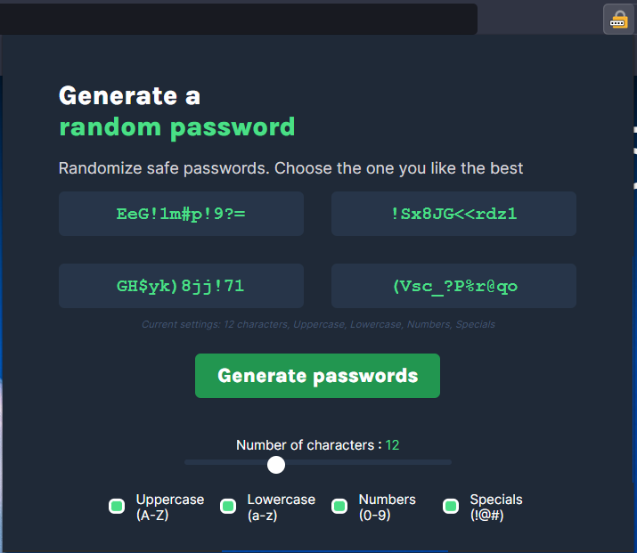

# Password Generator Chrome Extension

> Done in HTML/CSS and Javascript

This is a simple application to generate random password I created because of my lack of imagination when I have to choose a password. 

## Installation

- Download the repository
- Open the Extension tab of your Chrome-based browser
- Enable developer mode
- Load the uncompressed extension